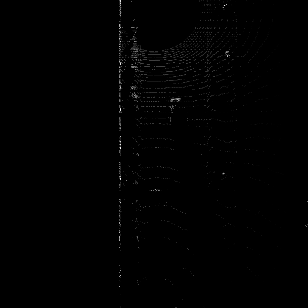

# Writeup: Track 3D-Objects Over Time - Mid Term

## Examples of Vehicles with Varying Degrees of Visibility in Point-Cloud

This example shows a truck with a trailer, we can clearly identify the trunk of the truck and the body and tail of the trailer, we can even see the side mirror and the truck, but none of the wheels are visible.

This example shows a vehicle which is very close to the vehicle doing detection. We can see that because of the blindspot, the vehicle is only partially visible, we can only see part of the roof, the side window and the back.

This example shows a fully visible vehicle. We can see the whole vehicle outline including the wheels, side mirror, windshield, side windows, tail lights etc.

This example shows several vehicles which only have their back side visible. We can see the rear wheels, back window, part of the vehicle top and side.

This example shows two partially visible vehicles. We can see the front of the vehicle, windshield, side of the vehicle and right side wheels.

This example shows several vehicles which almost have full body visible but no visible wheels.

This example also shows a truck with trailer, but the back of the trailer is not visible.

This example shows a partially visible vehicle. We can see the front of the vehicle, the side window, the side mirror and the roof window, and part of the front wheel.

This example shows a couple of partially visible vehicles. We can see the front of the vehicle, the side windows and part of the wheels.

This example shows a almost fully visible vehicle. We can see the whole outline, the wheels, side windows, windshield, side mirror, and vehicle roof.

Based on observation, I think side window and windshield are stable features on most vehicles. 

## Create Birds-Eye View from Lidar PCL

Result from ID_S2_EX1 shown below:

## Compute intensity Layer of the BEV map

Result from ID_S2_EX2 shown below:

## Compute height layer of the BEV map

Result from ID_S2_EX3 shown below:

